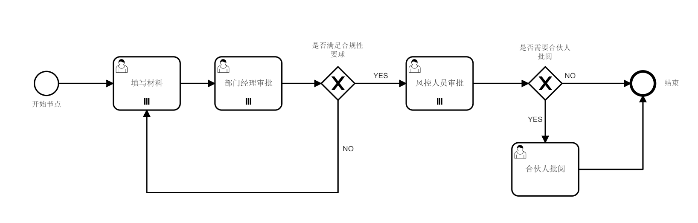
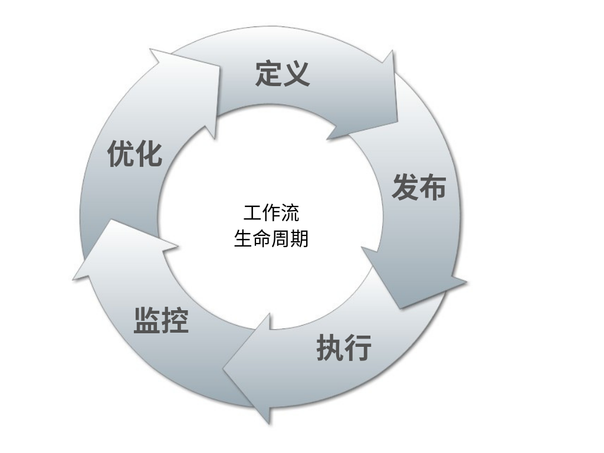

# Camunda流程引擎

[TOC]


## 一、流程引擎以及BPMN2.0规范

### Camunda和BPMN

Camunda BPM （BPM，Business Process Manager，业务流程管理）是一个灵活的工作流和过程自动化框架，它的核心是一个在Java虚拟机内部运行的原生BPMN 2.0流程引擎，因此它可以嵌入到任何Java应用程序或运行时容器中。Camunda BPM与Java EE 6集成，并可以与Spring Framework完美匹配。 Camunda BPM附带了用于创建工作流和决策模型，在生产中操作已部署模型以及允许用户执行分配给他们的工作流任务的工具。


> 维基百科对于BPMN的定义
>
> 业务流程模型和标记法（BPMN，Business Process Model and Notation）是对象管理组织（OMG，Object Management Group）维护的关于业务流程建模的行业性标准。它创建在与UML的活动图非常相似的流程图法（flowcharting）基础上，为“业务流程图”（BPD, Business Process Diagram）中的特定业务流程提供一套图形化标记法。BPMN的目标是，通过提供一套既匹配业务人员直观又能表现复杂流程语义的标记法，同时为技术人员和业务人员从事业务流程管理提供支持。BPMN规范还提供从标记法的图到执行语言基础构造的映射，尤其是业务流程执行语言（BPEL）。

BPMN文件的底层数据格式是xml，定义了一些标签的标准含义和图形表示。一方面通过图形方便所有人理解流程，另一方面限制实现方必须按着流程的要求来实现。

Camunda BPM官方提供了用于建模BPMN工作流和DMN决策的桌面应用程序Camunda Modeler。



对应的BPMN源码为：

```xml
......
  <bpmn:process id="Process_1em8emw" name="项目材料审核" isExecutable="true">
    <bpmn:startEvent id="StartEvent_1" name="开始节点">
      <bpmn:outgoing>SequenceFlow_1pagkpa</bpmn:outgoing>
    </bpmn:startEvent>
    <bpmn:sequenceFlow id="SequenceFlow_1pagkpa" sourceRef="StartEvent_1" targetRef="Task_0hn604q" />
    <bpmn:userTask id="Task_0hn604q" name="填写材料">
      <bpmn:incoming>SequenceFlow_1pagkpa</bpmn:incoming>
      <bpmn:incoming>SequenceFlow_058xsmq</bpmn:incoming>
      <bpmn:outgoing>SequenceFlow_0rs76c2</bpmn:outgoing>
      <bpmn:multiInstanceLoopCharacteristics />
    </bpmn:userTask>
      ......
    <bpmn:exclusiveGateway id="ExclusiveGateway_0ol3vgn" name="是否需要合伙人批阅">
      <bpmn:incoming>SequenceFlow_0icnkq2</bpmn:incoming>
      <bpmn:outgoing>SequenceFlow_1hoelow</bpmn:outgoing>
      <bpmn:outgoing>SequenceFlow_160qlaz</bpmn:outgoing>
    </bpmn:exclusiveGateway>
    <bpmn:endEvent id="EndEvent_1qn3z3o" name="结束">
      <bpmn:incoming>SequenceFlow_0ymsxgc</bpmn:incoming>
      <bpmn:incoming>SequenceFlow_160qlaz</bpmn:incoming>
    </bpmn:endEvent>
  </bpmn:process>
......

```

### 流程引擎的生命周期



- **定义**：工作流的生命周期从定义开始，此阶段的主要任务是收集业务需求并且转化为流程定义。
- **发布**：由开发人员打包各种资源，在流程引擎平台发布流程定义。在具体的流程引擎中包括流程定义文件（.bpmn结尾）、自定义表单、任务监听类等等。
- **执行**：具体的流程引擎按照事先定义好的流程处理路线以任务驱动的方式执行业务流程。
- **监控**：根据任务（Task）的结果做出相应的处理。
- **优化**：不满足业务需求的流程或者需求变更的流程进行重新设计和发布。

## 二、流程引擎基础概念介绍

### 多租户 Multitenancy

总的来说，多租户是一个软件为多个不同组织提供服务的概念。其核心是数据是隔离的，一个组织不能看到其他组织的数据。在这个语境中，一个这样的组织（或部门、团队……）被称为一个*租户（tenant）*。

在Camunda流程引擎中部署流程定义时，可以传递一个*租户标识符（tenant identifier）*，当然为了实际使用流程数据上的租户标识符，所有查询API都可以通过租户过滤。

### 流程定义 Process Definitions

一个流程定义规定了整个流程的结构，Camunda BPM使用BPMN 2.0规范作为它的主要设计语言，并在此基础上扩展了新的元素和属性。

主要属性：tenant，processDefinitionKey，version，processDefinitionId

### 流程实例 Process Instances

流程实例是一个流程定义（Process Definitions）与业务对象联系的入口，也就是说是流程定义的实际应用。

流程实例与流程定义的关系与面向对象编程中的对象和类之间的关系相同。

关键属性：processInstanceId、instanceRemark

### 流程执行对象 Execution

Execution的含义就是一个流程实例（Process Instances）具体要执行的过程对象。一个流程实例中，流程实例本身也是一条Execution，作为所有Execution的根节点一起形成一个树状结构。

### 活动实例 Activity Instances

Activity Instances的概念与Execution比较像，不同的是Exectuion是把Activity Instances串起来的线的唯一标识。Activity Instances也是树状结构的，可能是Task、Subprocess、MuiltiInstance等等。

### 用户任务 UserTask


### 任务和任务定义 Jobs and Job Definitions

### 流程变量 Process Variables

流程变量是指在流程运行状态的时候（ProcessInstance而不是ProcessDefinition）存储的数据，它的数据结构本质为`Map<String, Object>`，可以通过流程引擎提供的API进行数据的修改。流程变量是范围性的，也就是说可以为某个任务节点单独设置流程变量，这个值仅仅存在于当前的任务节点。也可以为整个流程设置全局性的流程变量，在整个流程的运行过程中都是可以查看并使用的。


## 三、表结构及接口设计

### 流程引擎API：


### 流程引擎表结构：


### 拓展表表结构

自定义拓展表的表结构以GC开头，主要用于存储流程引擎拓展功能的数据、投资管理系统特殊的业务逻辑以及前端在线画图功能的数据等。

| 表名            | 作用 |
| --------------- | ---- |
| gc_tenant       |      |
| gc_api          |      |
| gc_bpmn_setting |      |
| gc_task_setting |      |
|                 |      |


## 四、流程功能设计

### 选人

- 预设用户

  在流程设计的时候预先选好节点审批人，可以选用户、角色、部门、团队、团队-角色等等，也可自己实现接口用于选人。

- 动态选人（自选审批人）

  在流程运行的时候动态的选择下一节点的审批人。

### 监听


### 会签

### 代理

### 打回

### 撤回

### 跳转

### 加签

### 

## 五、提供的接口

详见接口文档

## 六、客户端对接